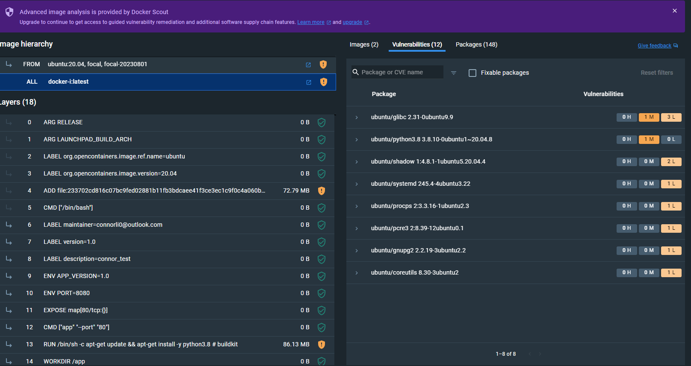

# Dockerfile Cheatsheet

## Instructions

- **ADD**: Copies files from the host to the container's filesystem at a specified destination.
- **CMD**: Specifies the default command to run when the container starts. It can be overridden when running the container.
- **ENTRYPOINT**: Sets the default application to run when the container starts. It's less flexible than CMD.
- **ENV**: Sets environment variables in the container.
- **EXPOSE**: Associates a specific port to enable networking between the container and the outside world.
- **FROM**: Defines the base image used to start the build process.
- **MAINTAINER**: Deprecated; use LABEL to specify image creator information.
- **RUN**: Executes a command during the build process.
- **USER**: Sets the user or UID under which the container runs.
- **VOLUME**: Enables access from the container to a directory on the host machine.
- **WORKDIR**: Sets the working directory for subsequent CMD or RUN instructions.
- **LABEL**: Adds labels and metadata to your Docker image.

## Usage

Example usage of some Dockerfile instructions:

```Dockerfile
# Use a base image
FROM ubuntu:20.04

# Set labels for the image
LABEL maintainer="connorli0@outlook.com"
LABEL version="1.0"
LABEL description="connor_test"
# Set environment variables
ENV APP_VERSION 1.0
ENV PORT 8080
# Copy files to the container
# ADD app.tar.gz /app/
# Expose a port
EXPOSE 80
# Specify the default command
CMD ["app", "--port", "80"]
# Run a command during build
RUN apt-get update && apt-get install -y python3.8
# Set the working directory
WORKDIR /app
# Define the entrypoint
ENTRYPOINT ["app"]
# Set the user to run the container
USER myuser
# Create a volume for data persistence
VOLUME /data
# Add metadata to the image
```

<details>
  <summary>Example Runs and Results</summary>
  
  ### Run Results
  run with ```docker build -t docker-i .```
```
[+] Building 0.0s (7/7) FINISHED                                                                                                                     docker:default
 => [internal] load build definition from dockerfile                                                                                                           0.0s
 => => transferring dockerfile: 713B                                                                                                                           0.0s 
 => [internal] load .dockerignore                                                                                                                              0.0s 
 => => transferring context: 2B                                                                                                                                0.0s 
 => [internal] load metadata for docker.io/library/ubuntu:20.04                                                                                                0.0s 
 => [1/3] FROM docker.io/library/ubuntu:20.04                                                                                                                  0.0s 
 => CACHED [2/3] RUN apt-get update && apt-get install -y python3.8                                                                                            0.0s 
 => CACHED [3/3] WORKDIR /app                                                                                                                                  0.0s 
 => exporting to image                                                                                                                                         0.0s 
 => => exporting layers                                                                                                                                        0.0s 
 => => writing image sha256:a7825a3370a67f08609060a0f5ccbb5dc79449494b73b2ce7b66777992913e79                                                                   0.0s 
 => => naming to docker.io/library/docker-i   
```

</details>

# Dockerfile Examples

## Python

```Dockerfile
# Use a Python base image
FROM python:3.9

# Set the working directory
WORKDIR /app

# Copy and install Python dependencies
COPY requirements.txt .
RUN pip install -r requirements.txt

# Run a Python script
COPY app.py .
CMD ["python", "app.py"]
```

## Node.js
```Dockerfile
# Use a Node.js base image
FROM node:14

# Set the working directory
WORKDIR /app

# Copy and install Node.js dependencies
COPY package.json .
COPY package-lock.json .
RUN npm install

# Run a Node.js application
COPY app.js .
CMD ["node", "app.js"]
```
## Java
```Dockerfile
# Use an OpenJDK base image
FROM openjdk:11-jre-slim

# Set the working directory
WORKDIR /app

# Copy and build the Java application
COPY pom.xml .
COPY src ./src
RUN mvn package

# Run the Java application
CMD ["java", "-jar", "target/myapp.jar"]
```
## Ruby
```Dockerfile
# Use a Ruby base image
FROM ruby:2.7

# Set the working directory
WORKDIR /app

# Copy and install Ruby gems
COPY Gemfile Gemfile.lock ./
RUN bundle install

# Run a Ruby application
COPY app.rb .
CMD ["ruby", "app.rb"]
```
## Golang
```Dockerfile
# Use a Golang base image
FROM golang:1.16

# Set labels for the image
LABEL maintainer="yourname@example.com"
LABEL version="1.0"
LABEL description="Go application"

# Set the working directory
WORKDIR /app

# Copy and build the Go application
COPY . .
RUN go build -o myapp

# Run the Go application
CMD ["./myapp"]
```

## Expose example
```dockerfile
# Use a base image
FROM nginx:alpine

# Expose port 80 for HTTP
EXPOSE 80

# Expose port 443 for HTTPS (optional)
EXPOSE 443

# Additional Dockerfile instructions here...

```
Then do ```docker run -d -p 8080:80 my-nginx-container```

## Volumn Example

```dockerfile
# Use a base image
FROM ubuntu:20.04

# Create a volume mount point
VOLUME /app/data

# Additional Dockerfile instructions here...

```

Then do ```docker run -v /host/path:/app/data my-image```

### Why use volumes in Docker:
- Data Persistence: Volumes allow you to persist data beyond the lifecycle of a container. When a container is removed, the data in the volume remains accessible.
- Data Sharing: Volumes enable data sharing between containers, making it easy to share configuration files or data between related containers.
- Backup and Restore: Volumes make it easier to back up and restore data because you can simply back up the volume directory on the host.
- Decoupling Data from Containers: Volumes allow you to separate data from the container, making it easier to manage and update containers independently of the data they use.
- Performance: Volumes are often used for database storage, and they can offer better performance compared to storing data directly inside containers.
